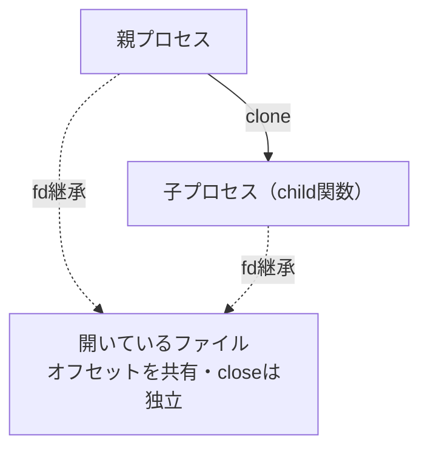
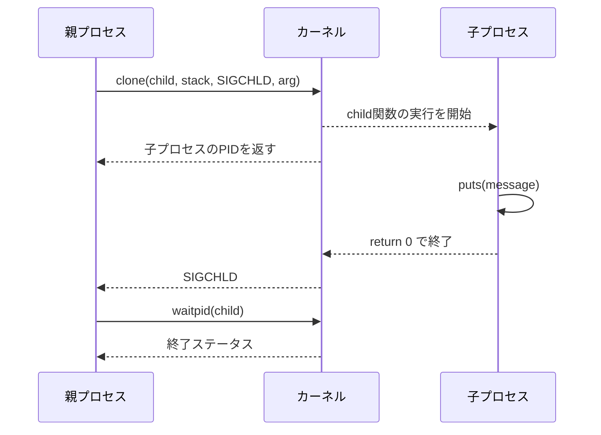

# ここではcloneシステムコールの使い方について説明する．

子プロセスから文字を出力するようなプログラムを作成します．

### プロトタイプ

ここではglibcが提供する`clone`ラッパー関数を使います．プロトタイプは以下のようになっています．

```c
int clone(int (*fn)(void *), void *stack, int flags, void *arg, ...
                 /* pid_t *parent_tid, void *tls, pid_t *child_tid */ );
```

**`clone`**ラッパー関数は、新しいプロセスを作成し、指定した関数を新しいプロセスで実行します。それまで実行していた、**`clone`**を呼び出したプロセスを親プロセス、新しく作成されたプロセスを子プロセスと呼びます。

### 動作

新しいプロセスを作成し，指定した関数を新しいプロセスで実行します．それまで実行していた，`clone`を呼び出したプロセスを親プロセス，新しく作成されたプロセスを子プロセスと呼びます．

### プロセスID

子プロセスは親プロセスとは別のプロセスなので，親プロセスとは違うプロセスIDが子プロセスに割り当てられます．

### メモリ

ここで扱うフラグでは，子プロセスが作成されるとき，親プロセスの仮想メモリ空間は子プロセスにコピーされたように見えます．実際には多くの場合copy-on-writeで効率化されており，子プロセスか親プロセスどちらか片方のプロセスでメモリの内容を書き換えても，もう片方のプロセスのメモリは影響を受けません．ただし，`CLONE_VM`を指定した場合はメモリ空間を共有するため挙動が変わります．

### ファイルディスクリプタ

親プロセスで開いていたファイルに関しては，子プロセスにファイルディスクリプタが継承されます．具体的には，ファイルの中の参照位置(オフセット)など開いているファイルの情報は共有されますが，片方のファイルディスクリプタを閉じてももう片方のファイルディスクリプタには影響しません．内部的に，開いているファイルの管理情報は1つしか存在せず，2つの独立したファイルディスクリプタを利用してその管理情報を利用できる状態です．

**図: cloneによる親子プロセスと、開いているファイルの共有**



### 引数

第一引数の`int (*fn)(void *)`は，子プロセスで実行する関数のポインタです．指定した関数が子プロセスが作成された直後に実行されます． 第二引数の`void *stack`は，子プロセスでスタック領域として利用するメモリのアドレスです．多くのCPUではスタックは高いアドレスから低いアドレスへ伸びるため，親プロセスでメモリ領域を確保し，そのメモリ領域の末尾のアドレスを指定します．

後述のように`mmap`システムコールを利用してメモリを確保します． 第三引数の`int flags`には，`clone`システムコールの動作を定めるフラグのうちいくつかと，子プロセスが終了した時に送られるシグナル1つを，ビットごとのORで指定します．フラグについては今はまだ利用しないので，今は`SIGCHLD`を指定します． 第四引数の`void *arg`には，子プロセスで実行する関数の，引数を指定します．子プロセスにメモリはコピーされるので，通常の変数のポインタを指定できます．

### 返り値

新しいプロセスの実行が正常に開始された場合は，子プロセスのプロセスIDが返されます．失敗した場合には`-1`が返ります．

### 使用方法

必要なファイルをインクルードします．一部のシステムコールの関数の利用のためには，`_GNU_SOURCE`マクロを定義することが必要です．

```c
#define _GNU_SOURCE
#include <sched.h>
#include <signal.h>
#include <sys/mman.h>
#include <sys/types.h>
#include <sys/wait.h>
```

子プロセスで実行する関数を宣言します．

```c
int child_process(void* arg){
    char* s = arg;
    puts(s);
    fflush(stdout);
    return 0;
}
```

子プロセスのスタックのためのメモリを確保します.

```c
void* stack = mmap(NULL,1024*1024,PROT_READ|PROT_WRITE,
    MAP_PRIVATE|MAP_ANONYMOUS|MAP_GROWSDOWN|MAP_STACK,-1,0);
if(stack == MAP_FAILED){
    perror("mmap failed");
    return -1;
}
```

子プロセスで実行する関数の引数を準備します．

```c
char* s = "say hello, child process!";
```

`clone`システムコールを呼びます．

```c
pid_t child = clone(child_process, (char*)stack + 1024*1024, SIGCHLD, s);
```

成功したか確かめるために，返り値を調べます．

```c
if(child == -1){
    puts("clone failed!");
    return -1;
}
```

適切なタイミングで，子プロセスが終了するまで待ちます．これは，待つ必要が無い場合でも行う必要があります．これを行わないと，子プロセスが終了した後，破棄されずにゾンビプロセスという状態になります．

```c
waitpid(child,NULL,0);
```

## 例

子プロセスから文字を出力するプログラム．

```c
#define _GNU_SOURCE
#include <sched.h>
#include <signal.h>
#include <sys/mman.h>
#include <sys/types.h>
#include <sys/wait.h>
#include <stdio.h>

int child(void* arg){
    char* message = (char*)arg;
    puts(message);
    fflush(stdout);
    return 0;
}

int main(){
    char* message = "Hello, child process!";
    size_t stack_size = 1024 * 1024;
    void* stack = mmap(NULL, stack_size, PROT_READ | PROT_WRITE,
        MAP_PRIVATE | MAP_ANONYMOUS | MAP_GROWSDOWN | MAP_STACK, -1, 0);

    if(stack == MAP_FAILED){
        perror("mmap failed");
        return -1;
    }

    pid_t child_pid = clone(child, (char*)stack + stack_size, SIGCHLD, message);

    if(child_pid == -1){
        perror("clone failed");
        munmap(stack, stack_size);
        return -1;
    }

    int child_status;
    waitpid(child_pid, &child_status, 0);
    if(WIFEXITED(child_status)){
        printf("Child process exited with status: %d\n", WEXITSTATUS(child_status));
    }

    munmap(stack, stack_size);
    return 0;
}
```

このプログラムでは、**`clone`**システムコールを使用して子プロセスを生成し、子プロセスがメッセージを出力します。親プロセスから渡されたメッセージは、子プロセス内の**`child`**関数で**`puts`**関数を使用して出力されます。なお、**`clone`**で作成した子プロセスはglibcのラッパー関数によって最終的に**`_exit`**で終了するため、標準出力がバッファリングされている（パイプやファイルへリダイレクトした場合など）と、バッファがフラッシュされず出力が反映されないことがあります。そのため、子プロセス側では**`puts`**の直後に**`fflush(stdout)`**を呼んでいます。子プロセスが終了したら、親プロセスは子プロセスの終了ステータスを表示します。また、**`mmap`**関数で確保したメモリ領域は**`munmap`**関数で解放しています。

**図: cloneで子プロセスを作り、終了を待つ流れ**



完全なサンプルコードは [examples/02-exec-result/clone](../../examples/02-exec-result/clone/README.md) にあります。

---
