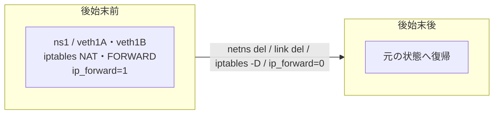

# 環境のクリーンアップ

使用が終わった後は、以下のコマンドを使用して名前空間、vethデバイス、NAT設定を削除してください。

**図: クリーンアップで実験用リソースを消す**



### iptablesルールの削除

NATの章で追加したルールを削除します。`ens4`は実際に指定したインターフェイス名に置き換えてください。

```bash
$ iptables --table nat --delete POSTROUTING --source 10.0.0.0/24 --out-interface ens4 --jump MASQUERADE
$ iptables --table filter --delete FORWARD --source 10.0.0.0/24 --jump ACCEPT
$ iptables --table filter --delete FORWARD --destination 10.0.0.0/24 --match conntrack --ctstate ESTABLISHED,RELATED --jump ACCEPT
```

### フォワーディング設定を戻す

この実験のためにIPv4フォワーディングを有効にした場合は、不要であれば戻します。

```bash
$ sysctl -w net.ipv4.ip_forward=0
```

### 名前空間の削除

名前空間**`ns1`**を削除します。

```bash
$ ip netns del ns1
```

### vethデバイスの削除

vethデバイスペア**`veth1A`**と**`veth1B`**を削除します。

```bash
$ ip link del veth1A
```

`ip netns del ns1`によって`veth1B`が削除されると，ペアになっている`veth1A`も同時に削除されることがあります。その場合，`ip link del veth1A`は「存在しない」というエラーになりますが，すでに削除済みなので問題ありません。

これで、ネットワーク名前空間とvethデバイスの設定、パケットフィルタリング設定の例、および環境のクリーンアップに関する手順が完了しました。
