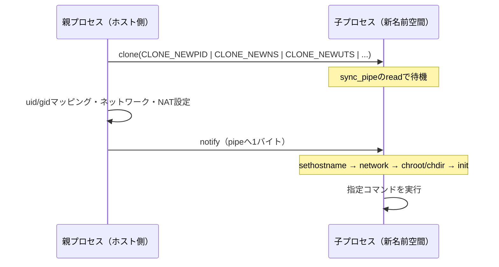

# ミニコンテナ自作の全体像

ここまでの章では，Linuxのプロセス，ファイル，`clone`，`execve`，`pipe`，PID名前空間，User名前空間，Network名前空間，veth，NATを個別に見てきました．ここからは，それらを1つずつ組み合わせて，Dockerのコアとなる部分を小さく作ります．

この章で作るものを`mini-container`と呼びます．完全なサンプルコードは [examples/04-mini-container](../../examples/04-mini-container/README.md) に置いてあります．本文では重要な部分を順に取り出しながら，なぜその処理が必要なのかを説明します．

完成したプログラムは，おおむね次の形で実行します．

```bash
$ sudo ./build/mini-container [OPTIONS] ROOTFS COMMAND [ARGS...]
```

`ROOTFS`には，コンテナのルートファイルシステムとして使うディレクトリを指定します．`COMMAND`以降には，そのルートファイルシステムの中で実行したいコマンドを指定します．たとえば`ROOTFS`に`./rootfs`を指定し，`COMMAND`に`/bin/sh`を指定すると，プロセスから見える`/`を`./rootfs`へ切り替えた状態で`/bin/sh`を実行します．

ただし，ここで作るものは本物のDockerではありません．イメージのpull，レイヤーファイルシステム，cgroups，seccomp，AppArmorやSELinuxとの連携，ログ収集，OCI Runtime Specificationへの対応などは扱いません．この章の目的は，コンテナの中心にある処理を，自分の手で追えるサイズにすることです．

## この章で扱うこと

`mini-container`では，次の処理を実装します．

- PID名前空間を作り，コンテナ内の最初のプロセスをPID 1にする
- Mount名前空間を作り，マウント操作がホストへ広がりにくい状態にする
- UTS名前空間を作り，コンテナ内だけのホスト名を設定する
- `chroot`と`chdir`でルートディレクトリを変更する
- 簡単な`init`処理を用意し，指定されたコマンドを実行して終了コードを返す
- User名前空間を使う場合に，`uid_map`と`gid_map`を書き込む
- Network名前空間を使う場合に，vethペアでホストとコンテナをつなぐ
- 必要に応じて`iptables`でNATを設定し，終了時に片付ける

こう並べると大きなプログラムに見えますが，中心になる構造は単純です．親プロセスはホスト側に残って準備を行い，子プロセスは新しい名前空間の中で待機します．親が準備を終えたら，子プロセスに「もう進んでよい」と知らせます．子プロセスはそのあと，ファイルシステムを切り替えて，指定されたコマンドを実行します．

**図: 親が準備し、子が待ち、準備完了後に子が実行する**



この「親が準備し，子が待ち，準備が終わったら子が実行する」という形が，この章の重要な骨格です．

## 実験するときの注意

この章のプログラムは学習用です．`chroot`，名前空間，veth，ルーティング，`iptables`はホストの状態に影響します．実験用のLinux仮想マシン，または破棄できるLinux環境で実行してください．普段使いのマシンや重要なサーバで試すべきではありません．

macOSではLinux名前空間や`iptables`を直接使えないため，この章のサンプルはLinux専用です．Apple Silicon Macで読み進める場合でも，実行はLinux VMやLinuxコンテナ環境の中で行います．ただし，この本のPDF生成やTypst変換はmacOS上でも実行できます．

また，`chroot`だけで安全なコンテナができるわけではありません．`chroot`はファイルシステムの見え方を変える機能であり，プロセスID，ユーザーID，ネットワーク，マウントテーブルなどを分離するものではありません．コンテナらしい分離を作るには，複数のLinux機能を組み合わせる必要があります．

## コマンドラインを決める

完成版では以下のオプションを受け取ります．

```bash
$ sudo ./build/mini-container \
    --hostname mini \
    --userns \
    --network \
    --nat-if eth0 \
    --mount-proc \
    ./rootfs /bin/sh
```

それぞれの意味は次の通りです．

| オプション | 意味 |
| --- | --- |
| `--hostname NAME` | UTS名前空間内のホスト名を設定する |
| `--userns` | User名前空間を作り，現在のUID/GIDをコンテナ内の0へ対応付ける |
| `--network` | Network名前空間を作り，vethでホスト側と接続する |
| `--nat-if IFACE` | 指定した外側インターフェイスへ出るNATルールを追加する |
| `--mount-proc` | `chroot`後に`/proc`へprocfsをマウントする |

`--nat-if`は外へ出るインターフェイス名を必要とします．環境によって`eth0`，`ens4`，`enp0s1`など名前が違うため，固定値にはしません．実行する前に`ip route show default`で確認します．

```bash
$ ip route show default
default via 10.0.2.2 dev eth0
```

この場合，外側へ出るインターフェイスは`eth0`です．

## 設定を構造体にまとめる

親プロセスと子プロセスの両方が同じ設定を参照するので，必要な値を構造体にまとめます．

```c
struct container_config {
    const char* rootfs;
    char** command;
    const char* hostname;
    const char* nat_if;
    bool use_userns;
    bool use_network;
    bool mount_proc;
    int sync_pipe[2];
};
```

`rootfs`は`chroot`先のディレクトリです．`command`は実行するコマンドと引数です．`hostname`はUTS名前空間内のホスト名です．`nat_if`にはNATで使う外側インターフェイス名を入れます．`use_userns`，`use_network`，`mount_proc`は，それぞれUser名前空間，Network名前空間，procfsマウントを使うかどうかを表します．

最後の`sync_pipe`は親子の同期に使います．この章のプログラムでは，子プロセスを作ったあとに親プロセスがUser名前空間のマッピングやネットワーク設定を行います．子プロセスが準備前に先へ進むと困るため，パイプを使って待たせます．

`main`関数は，コマンドライン引数を解析してこの構造体を作り，`start_container`へ渡すだけにします．

```c
int main(int argc, char** argv) {
    struct container_config config;
    int parsed = parse_args(argc, argv, &config);
    if (parsed > 0) {
        return 0;
    }
    if (parsed < 0) {
        return 1;
    }
    return start_container(&config);
}
```

こうしておくと，コマンドライン処理と，名前空間やネットワークを扱う処理を分けられます．以降の章では，この`start_container`の中身を少しずつ作っていきます．
