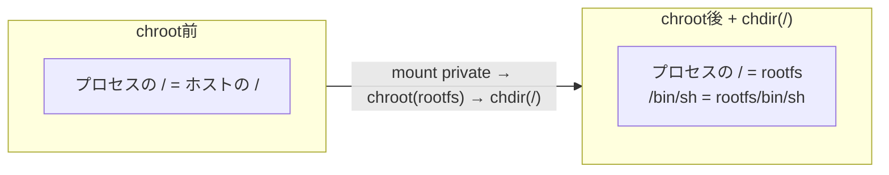

# chrootからchdirへ進む

コンテナ内のプロセスから見えるルートディレクトリを変えるには，`chroot`を使います．`chroot`は，呼び出したプロセスとその子孫プロセスに対して，`/`として見える場所を変更します．

ただし，`chroot`しただけではカレントディレクトリは自動的には変わりません．そのため，続けて`chdir("/")`を呼びます．この2つはセットで考える方が安全です．

**図: chroot+chdirでプロセスの「/」を切り替える**



```c
static int setup_rootfs(const char* rootfs) {
    if (mount(NULL, "/", NULL, MS_REC | MS_PRIVATE, NULL) != 0) {
        perror("mount private /");
        return -1;
    }
    if (chroot(rootfs) != 0) {
        perror("chroot");
        return -1;
    }
    if (chdir("/") != 0) {
        perror("chdir");
        return -1;
    }
    return 0;
}
```

最初の`mount(NULL, "/", NULL, MS_REC | MS_PRIVATE, NULL)`は，マウント伝播をprivateにする処理です．Mount名前空間を作っていても，マウントの伝播設定によっては操作が他の名前空間へ伝わる場合があります．学習用の小さな実装でも，`chroot`や`procfs`のマウントを扱う前に，マウント伝播を切っておく方が安全です．

`chroot(rootfs)`のあと，プロセスから見える`/`は`rootfs`になります．たとえば`rootfs`が`./rootfs`であれば，コンテナ内の`/bin/sh`はホスト上の`./rootfs/bin/sh`を指します．

## procfsをマウントする

`--mount-proc`を指定した場合は，`chroot`後の`/proc`にprocfsをマウントします．

```c
static int mount_procfs(void) {
    if (mkdir("/proc", 0555) != 0 && errno != EEXIST) {
        perror("mkdir /proc");
        return -1;
    }
    if (mount("proc", "/proc", "proc", 0, "") != 0) {
        perror("mount proc");
        return -1;
    }
    return 0;
}
```

`/proc`が見えると，コンテナ内で`ps`や`cat /proc/self/status`のような確認がしやすくなります．一方で，procfsはカーネルの情報を見せる疑似ファイルシステムなので，何をどこへマウントするかは慎重に扱う必要があります．

## rootfsを用意するときの注意

rootfsとしてホストの`/`を指定すると，実験は簡単です．しかし，ファイルシステムの隔離としては意味が薄くなります．コンテナらしさを確認するなら，専用のrootfsを作ります．

```bash
$ sudo debootstrap --variant=minbase bookworm ./rootfs http://deb.debian.org/debian
```

作ったrootfsでシェルを起動します．

```bash
$ sudo ./build/mini-container --hostname mini --mount-proc ./rootfs /bin/sh
```

専用rootfsを使うと，コンテナ内にどのコマンドやライブラリが存在するかも自分で管理する必要があります．`/bin/sh`がなければシェルは起動できません．`/bin/sh`が存在しても，動的リンクされたバイナリなら必要な動的リンカや共有ライブラリもrootfs内に必要です．

```bash
$ ldd ./rootfs/bin/sh
```

`execvp`が`No such file or directory`を返す場合，コマンドそのものではなく，動的リンカや共有ライブラリが見つかっていないことがあります．rootfsを自作するときは，この点を疑います．
