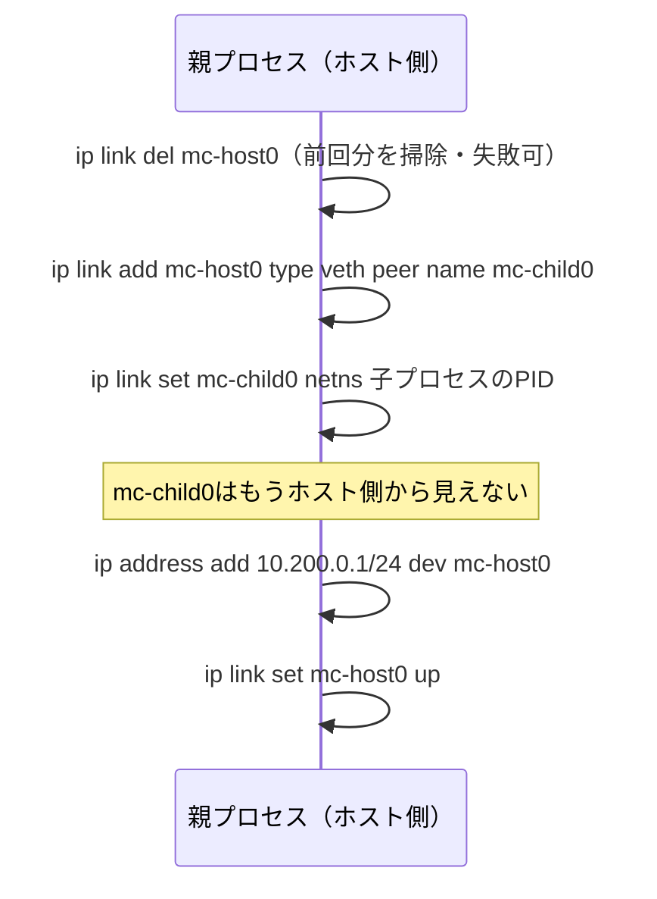

# 親プロセスのネットワークを設定する

親プロセスはホスト側のNetwork名前空間に残っています．そのため，ホスト側のveth作成や，子プロセスのNetwork名前空間への移動を担当します．

ここではホスト側のインターフェイス名を`mc-host0`，コンテナ側へ渡す一時的な名前を`mc-child0`にします．

**図: 親プロセスのネットワーク準備（setup_parent_network）**



## vethを作って子へ渡す

親側の設定は次のようになります．

```c
static int setup_parent_network(pid_t child_pid) {
    char pid_buf[32];
    snprintf(pid_buf, sizeof(pid_buf), "%d", child_pid);

    char* const delete_old[] = {"ip", "link", "del", "mc-host0", NULL};
    run_program(delete_old, true);

    char* const add_veth[] = {
        "ip", "link", "add", "mc-host0", "type", "veth", "peer", "name", "mc-child0", NULL,
    };
    if (run_program(add_veth, false) != 0) {
        return -1;
    }

    char* const move_child[] = {"ip", "link", "set", "mc-child0", "netns", pid_buf, NULL};
    if (run_program(move_child, false) != 0) {
        return -1;
    }

    char* const addr_host[] = {"ip", "address", "add", "10.200.0.1/24", "dev", "mc-host0", NULL};
    if (run_program(addr_host, false) != 0) {
        return -1;
    }

    char* const up_host[] = {"ip", "link", "set", "mc-host0", "up", NULL};
    if (run_program(up_host, false) != 0) {
        return -1;
    }

    return 0;
}
```

`ip link set mc-child0 netns <pid>`により，`mc-child0`は子プロセスのNetwork名前空間へ移動します．移動したあとは，親プロセス側から普通に`ip address add ... dev mc-child0`のように設定することはできません．そのインターフェイスは，もう親のNetwork名前空間には存在しないからです．

だから，親が行うのは「vethを作る」「片方を子へ渡す」「ホスト側を設定する」までです．コンテナ側に移動したインターフェイスの設定は，子プロセス側で行います．

## 古いvethを消してから始める

最初に`ip link del mc-host0`を実行しているのは，前回の実験でインターフェイスが残っている場合に備えるためです．

```c
char* const delete_old[] = {"ip", "link", "del", "mc-host0", NULL};
run_program(delete_old, true);
```

この削除は失敗しても構いません．初回実行では`mc-host0`が存在しないため，むしろ失敗するのが普通です．そのため`allow_failure`を`true`にしています．

ネットワーク実験では，古い設定が残っていると次の結果が分かりにくくなります．作る前に消し，終了時にも消す，という形にしておくと実験しやすくなります．
