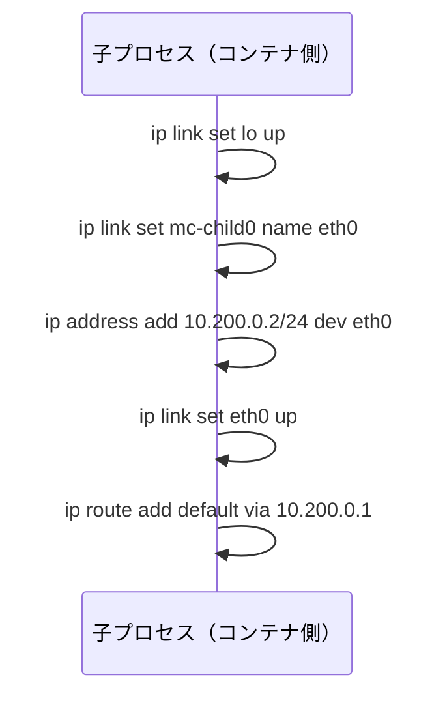

# 子プロセスのネットワークを設定する

親プロセスから準備完了の通知を受け取ったあと，子プロセスは自分のNetwork名前空間内でネットワークを設定します．この時点で，親が作った`mc-child0`は子プロセスのNetwork名前空間へ移動済みです．

子プロセス側では，ループバックを有効にし，`mc-child0`を`eth0`へリネームし，IPアドレスとデフォルトルートを設定します．

**図: 子プロセスのネットワーク設定（setup_child_network）**



```c
static int setup_child_network(void) {
    char* const up_loopback[] = {"ip", "link", "set", "lo", "up", NULL};
    if (run_program(up_loopback, false) != 0) {
        return -1;
    }

    char* const rename_child[] = {"ip", "link", "set", "mc-child0", "name", "eth0", NULL};
    if (run_program(rename_child, false) != 0) {
        return -1;
    }

    char* const addr_child[] = {
        "ip", "address", "add", "10.200.0.2/24", "dev", "eth0", NULL,
    };
    if (run_program(addr_child, false) != 0) {
        return -1;
    }

    char* const up_child[] = {"ip", "link", "set", "eth0", "up", NULL};
    if (run_program(up_child, false) != 0) {
        return -1;
    }

    char* const default_route[] = {"ip", "route", "add", "default", "via", "10.200.0.1", NULL};
    if (run_program(default_route, false) != 0) {
        return -1;
    }

    return 0;
}
```

## loを有効にする

`lo`をupすることを忘れないようにします．

```c
char* const up_loopback[] = {"ip", "link", "set", "lo", "up", NULL};
```

ループバックインターフェイスがdownのままだと，コンテナ内のプログラムが`localhost`へ接続しようとしたときに失敗します．外部ネットワークだけでなく，コンテナ内部の通信にも`lo`は必要です．

## eth0へリネームする

親側では，一時的に`mc-child0`という名前でvethを作りました．子側ではこれを`eth0`へ変更します．

```c
char* const rename_child[] = {"ip", "link", "set", "mc-child0", "name", "eth0", NULL};
```

これは必須ではありません．`mc-child0`のままでも通信できます．ただ，Dockerコンテナの中でよく見るインターフェイス名に近づけるため，ここでは`eth0`へ変えています．

## デフォルトルートを設定する

最後に，コンテナ側のデフォルトルートをホスト側vethのアドレスへ向けます．

```c
char* const default_route[] = {"ip", "route", "add", "default", "via", "10.200.0.1", NULL};
```

これにより，コンテナ内から宛先が同一サブネット外のパケットを送ると，まず`10.200.0.1`へ渡されます．その先で外部へ出すには，ホスト側でIPフォワーディングとNATを設定します．
