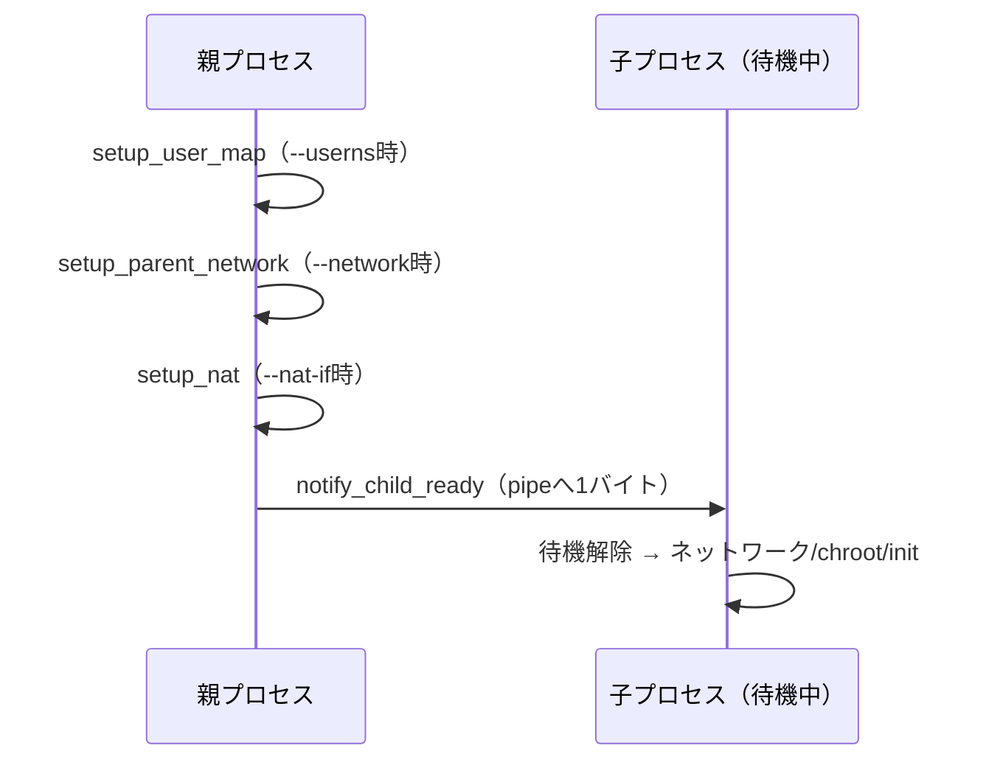

# ネットワーク処理を実行する

ここまでに作ったネットワーク処理を，`start_container`へ組み込みます．重要なのは順番です．親プロセスは，子プロセスを作ったあと，子プロセスをまだ待たせたまま，必要な設定を行います．

**図: start_containerでの準備順（最後にnotifyで子を解放）**



```c
if (config->use_userns &&
    setup_user_map(child, getuid(), getgid()) != 0) {
    goto fail;
}

if (config->use_network && setup_parent_network(child) != 0) {
    goto fail;
}

if (config->nat_if != NULL && setup_nat(config->nat_if) != 0) {
    goto fail;
}

if (notify_child_ready(config->sync_pipe[1]) != 0) {
    goto fail;
}
```

User名前空間のマッピング，親側ネットワーク設定，NAT設定を終えてから，最後に`notify_child_ready`を呼びます．この時点まで，子プロセスはパイプの`read`で待っています．

## 最小構成で実行する

最初の確認では，rootfsとしてホストの`/`を指定し，`/bin/true`を実行します．

```bash
$ sudo ./build/mini-container / /bin/true
$ echo $?
0
```

この実行では，ファイルシステムの隔離としてはほとんど意味がありません．ホストの`/`をそのままrootfsとして使っているからです．それでも，PID名前空間，Mount名前空間，UTS名前空間，親子同期，`chroot`，簡単な`init`，終了コードの受け渡しが通ることを確認できます．

次に，ホスト名を変えてみます．

```bash
$ sudo ./build/mini-container --hostname mini / /bin/hostname
mini
```

`CLONE_NEWUTS`を使っているため，このホスト名変更はコンテナ内だけに影響します．実行後にホスト側で`hostname`を確認しても，ホスト名は変わっていないはずです．

## Network名前空間を試す

Network名前空間を有効にするには`--network`を付けます．

```bash
$ sudo ./build/mini-container --network / /bin/true
```

この実行では，ホスト側に`mc-host0`，コンテナ側に`eth0`を作成し，コンテナ終了後に`mc-host0`を削除します．中の様子を見たい場合は，シェルを起動します．

```bash
$ sudo ./build/mini-container --network / /bin/sh
```

コンテナ内で確認します．実際に実行すると，次のように表示されます．

```bash
# ip route show default
default via 10.200.0.1 dev eth0
```

```bash
# ip address show eth0
2: eth0@if3: <BROADCAST,MULTICAST,UP,LOWER_UP> mtu 1500 state UP
    inet 10.200.0.2/24 scope global eth0
       valid_lft forever preferred_lft forever
```

`lo`と`eth0`が見え，`eth0`に`10.200.0.2/24`が付いていれば，子プロセス側のネットワーク設定が通っています．デフォルトルートが`10.200.0.1`を向いていれば，ホスト側へパケットを渡す準備もできています．上の出力は実機での確認結果であり，`ip route show default`が`10.200.0.1`を指していることが，子側のルーティング設定まで通った証拠になります．

ホスト側へ疎通確認するなら，コンテナ内から次を実行します．

```bash
# ping -c 1 10.200.0.1
PING 10.200.0.1 (10.200.0.1) 56(84) bytes of data.
64 bytes from 10.200.0.1: icmp_seq=1 ttl=64 time=0.052 ms
```

ここまで通れば，Network名前空間，veth，IPアドレス設定，ルーティングがつながっています．

> 対話シェルを終了したとき，`Cannot set tty process group (No such process)`というメッセージが出ることがあります．これは，新しいPID名前空間の中にいる対話シェルが，終了時に端末のフォアグラウンドプロセスグループを元へ戻そうとして失敗するためです．`sudo`から継承した制御端末のプロセスグループ番号はホスト側の番号空間のものなので，コンテナ側からは存在しないIDに見えます．`mini-container`は端末（PTY）の割り当てやセッションリーダー化（`setsid`）まで行わない最小実装なので，このメッセージが出ます．コマンドの実行結果には影響しません．`docker run -t`がこれを出さないのは，コンテナ用に新しいPTYを割り当て，最初のプロセスをセッションリーダーにしているからです．
