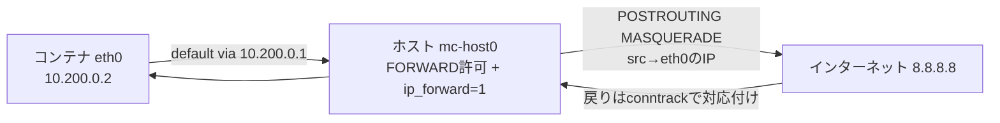

# iptablesをいじる

vethでホストとコンテナをつないだだけでは，コンテナからインターネットへ出られるとは限りません．コンテナ側の送信元IPアドレスは`10.200.0.2`です．このプライベートなアドレスを外へ出すには，ホスト側でIPフォワーディングとNATを設定します．

まず，IPv4フォワーディングを有効にします．プログラムでは`/proc/sys/net/ipv4/ip_forward`へ`1`を書き込みます．

```c
write_file("/proc/sys/net/ipv4/ip_forward", "1\n", true);
```

次に，`iptables`でNATルールと転送許可ルールを追加します．外側インターフェイスが`eth0`の場合，コマンドとしては次のような内容です．

```bash
$ sudo iptables -t nat -A POSTROUTING -s 10.200.0.0/24 -o eth0 -j MASQUERADE
$ sudo iptables -A FORWARD -i mc-host0 -o eth0 -j ACCEPT
$ sudo iptables -A FORWARD -i eth0 -o mc-host0 -m state --state RELATED,ESTABLISHED -j ACCEPT
```

## プログラムからNATを設定する

プログラムでは，これらも引数配列として実行します．

```c
static int setup_nat(const char* outbound_if) {
    if (write_file("/proc/sys/net/ipv4/ip_forward", "1\n", true) != 0) {
        return -1;
    }

    char* const nat_rule[] = {
        "iptables", "-t", "nat", "-A", "POSTROUTING", "-s", "10.200.0.0/24",
        "-o", (char*)outbound_if, "-j", "MASQUERADE", NULL,
    };
    if (run_program(nat_rule, false) != 0) {
        return -1;
    }

    char* const forward_out[] = {
        "iptables", "-A", "FORWARD", "-i", "mc-host0", "-o", (char*)outbound_if, "-j", "ACCEPT", NULL,
    };
    if (run_program(forward_out, false) != 0) {
        return -1;
    }

    char* const forward_in[] = {
        "iptables", "-A", "FORWARD", "-i", (char*)outbound_if, "-o", "mc-host0",
        "-m", "state", "--state", "RELATED,ESTABLISHED", "-j", "ACCEPT", NULL,
    };
    if (run_program(forward_in, false) != 0) {
        return -1;
    }

    return 0;
}
```

`MASQUERADE`は，外へ出るパケットの送信元アドレスを，外側インターフェイスのアドレスに変換します．戻りのパケットはconntrackにより対応付けられ，コンテナ側へ戻されます．

**図: コンテナ(10.200.0.2)から外部への往復とNAT**



## 片付ける

追加したルールは，終了時に削除します．

```bash
$ sudo iptables -t nat -D POSTROUTING -s 10.200.0.0/24 -o eth0 -j MASQUERADE
$ sudo iptables -D FORWARD -i mc-host0 -o eth0 -j ACCEPT
$ sudo iptables -D FORWARD -i eth0 -o mc-host0 -m state --state RELATED,ESTABLISHED -j ACCEPT
```

`iptables`のルールは順序を持ちます．同じルールを何度も追加すると，表示上も動作上も分かりにくくなります．追加と削除は必ずセットで考えます．

## NATつきで外へ出る

コンテナから外部ネットワークへ出たい場合は，`--nat-if`を指定します．このオプションは`--network`も暗黙に有効にします．

```bash
$ ip route show default
default via 10.0.2.2 dev eth0

$ sudo ./build/mini-container --network --nat-if eth0 / /bin/sh
```

コンテナ内で外部へpingします．実機で実行すると，次のように応答が返ります．

```bash
# ping -c 1 8.8.8.8
PING 8.8.8.8 (8.8.8.8) 56(84) bytes of data.
64 bytes from 8.8.8.8: icmp_seq=1 ttl=117 time=3.12 ms

--- 8.8.8.8 ping statistics ---
1 packets transmitted, 1 received, 0% packet loss, time 0ms
rtt min/avg/max/mdev = 3.116/3.116/3.116/0.000 ms
```

この応答が返れば，ここまでに作ったものがすべて連動して動いたことになります．vethペアの作成，コンテナ側`eth0`への`10.200.0.2/24`割り当てとデフォルトルート，`ip_forward`の有効化，`MASQUERADE`による送信元アドレスの書き換え，`FORWARD`の許可ルールとconntrackによる復路——このどれか1つでも欠けると応答は返りません．なお，この確認は`iptables`が`nf_tables`バックエンド（`iptables-nft`）の環境でも通っています．

名前解決も確認したい場合は，rootfsの中に`/etc/resolv.conf`が必要です．ホストの`/`をrootfsとして使っている実験なら，ホスト側の設定がそのまま見えます．専用のrootfsを作る場合は，DNS設定も用意する必要があります．
